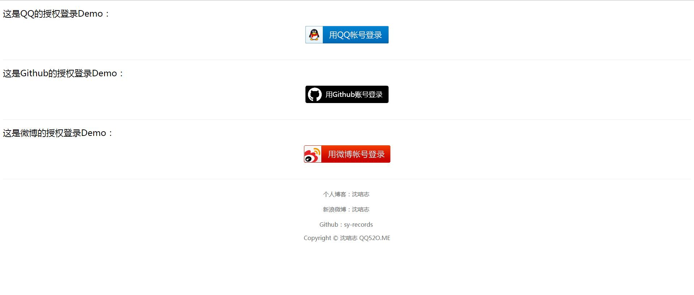

# OAuthLogin

:sparkles: PHP 第三方登录授权 SDK，集成中！   

目前已经集成好了QQ、微博、Github的授权登录，能够拿到用户信息，但是可能还是有一些地方没有考虑到，未做处理，后期再继续修改吧   

## 参与我

如果有任何想法或需求，可以在 issue 中告诉我，同时也欢迎各种 pull requests

## 环境依赖

PHP5.4以上，且需要开启curl扩展、session.auto_start扩展

## 安装

### composer安装

```
composer require sy-records/oauth-login
```

### 手动加载

需要什么登录就引入什么登录文件，例如test中demo

## 用法

### 演示Demo

访问test文件中的index.html。补全对应文件夹中index.php和callback.php中的参数即可

### Demo截图

<p align="center">
    
</p>

### QQ授权登录

```php
use Auth\QqConnect;

# https://connect.qq.com/manage.html#/ 创建应用
$appId = ''; # APP ID
$appKey = '';# APP Key
$callBackUrl = ''; # 授权回调地址

$qqAuth = new QqConnect($appId,$appKey,$callBackUrl);
# 授权登录页面
$qqAuth->qqLogin();
# 授权回调方法
$res = $qqAuth->qqCallBack();
var_dump($res); # 用户信息
```

### 微博授权登录

```php
use Auth\WeiboConnect;

# http://open.weibo.com/apps/new?sort=web 创建网站应用
$appKey = ''; # 网站应用申请后的App Key
$appSecret = ''; # 网站应用申请后的App Secret
$callback = ''; # 授权回调地址

$weiboAuth = new WeiboConnect($appKey,$appSecret,$callback);
# 授权登录页面
$weiboAuth->weiboLogin();
# 授权回调方法
$res = $weiboAuth->weiboCallBack();
var_dump($res); # 用户信息
```

### Github授权登录

```php
use Auth\GithubConnect;

# https://github.com/settings/developers 创建OAuth App
$clientId = ''; # 创建OAuth App得到的Client ID
$clientSecret = ''; # 创建OAuth App得到的Client Secret
$callback = ''; # Authorization callback URL 回调地址

$githubAuth = new GithubConnect($clientId,$clientSecret,$callback);
# 授权登录页面
$githubAuth->githubLogin();
# 授权回调方法
$res = $githubAuth->githubCallBack();
var_dump($res); # 用户信息
```

## 版权信息

本SDK由沈唁集成，遵循GPL3.0开源协议发布，并提供免费使用   

版权所有Copyright © 2018 by 沈唁志   

All rights reserved   

更多细节参阅 [LICENSE](https://github.com/sy-records/OAuthLogin/blob/master/LICENSE) 

## 赞助

若对您有帮助，可以赞助并支持下作者哦，谢谢！   

<p align="center">
    
</p>
